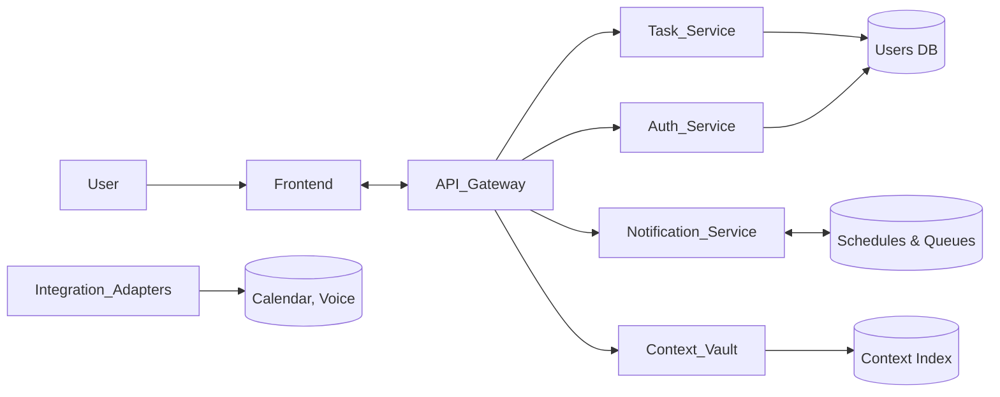

# Technical Architecture

- **Frontend**: React/Vue SPA + PWA, TailwindCSS.
- **API Gateway**: Routing, rate limits, orchestration.
- **Services**: Auth (OAuth2/JWT), Task (CRUD, business logic), Notification (scheduling), Context Vault (RAG indexing).
- **Integrations**: Calendar sync, voice API, widget feeds.
